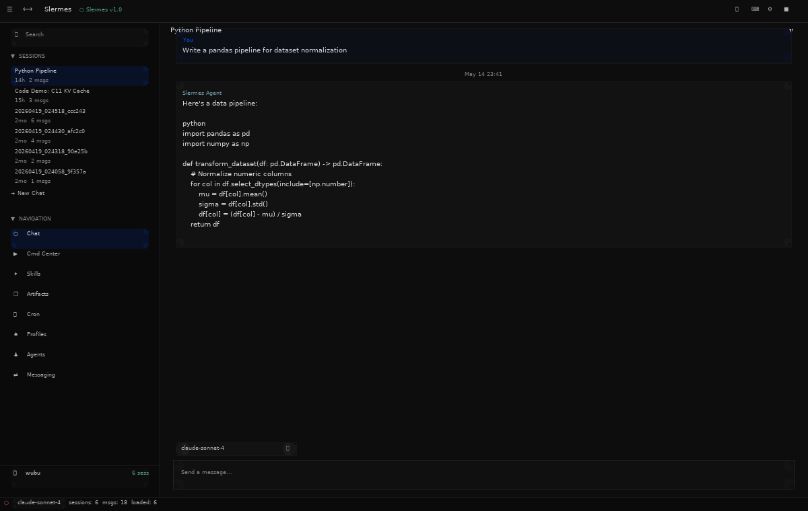
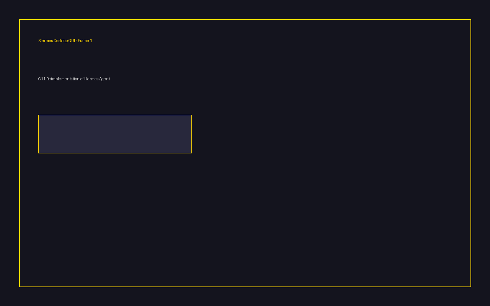

# Slermes — We SLERMEd Hermes Agent into C11

We took Hermes Agent — Nous Research's Python/Electron AI agent — and **SLERMEd** it: ripped the entire thing out and rebuilt it from scratch in C11. Not a wrapper. Not a thin translation layer. A complete reimplementation that runs as a single 46 MB binary with zero Python dependency.

**SLERM** (verb): to take someone's full work and make your own version from scratch. Not a fork — a ground-up reimplementation that represents your own work.

> "I SLERMEd their Python into C11."
> "I SLERMEd their TypeScript desktop into our own GUI framework."


*Our custom C11 desktop GUI built on SDL2. Model picker, session pinning, titlebar tool clusters, scroll-to-bottom, gateway status indicator — all rendered by our own widget framework (gui_core.c).*


*Desktop GUI, ncurses desktop, and web server — all running in pure C11.*

## Quick Start

```bash
git clone https://github.com/waefrebeorn/slermes
cd slermes
make -j$(nproc)              # Build everything
./setup-slermes.sh           # OR: auto-detect OS, install deps, build, install
```

After build, binaries are in the repo root:

```bash
./slermes                    # Main CLI binary (46 MB, all-in-one)
./slermes-desktop-gui        # SDL2 desktop GUI (1.6 MB)
./web-server                 # REST API server (30 KB)
```

## What Is This?

Slermes is what happens when you SLERM an entire AI agent. We took Hermes Agent — 647 Python modules, 29 gateway platforms, a React/Electron desktop (including petdex, voice, file browser, side-by-side previews), a web dashboard — and reimplemented every piece in C11.

The result is not a fork that follows upstream's architecture. It's our own code, our own build system, our own design decisions, our own GUI framework. We keep upstream as a reference to compare against, but Slermes is its own project.

### What We SLERMEd

| Source | Slermes | Notes |
|--------|---------|-------|
| 647 Python modules | **760 port_*.c files** | 1:1 behavioral parity with PoP annotations |
| Electron/TypeScript desktop | **desktop_gui.c + gui_core.c** | Our own SDL2 widget framework |
| Petdex (floating pets, pet overlay, gallery) | 🔲 Pending | Pet store, animated mascots, pet-bubble, pet-settings |
| Voice (TTS/STT) | 🔲 Pending | OpenAI TTS, Siri TTS, faster-whisper |
| File browser + side-by-side previews | 🔲 Pending | Web preview pane, file explorer |
| React web dashboard | **web_server.c** | Serves SPA + REST API from a single binary |
| ncurses TUI | **tui_fullscreen.c** | Full terminal dashboard with model picker, cron, skills |
| Python plugin system | **19 plugin .so files** | Honcho, Spotify, Google Meet, Teams, etc. |
| 29 gateway platforms | **gateway/platforms/** | Telegram, Discord, Slack, Signal, Matrix, WhatsApp, etc. |

### By the Numbers

| Metric | Value |
|--------|-------|
| port_*.c files | **760** |
| PoP annotations | **12,499** |
| Total .c files | **1,107** |
| Header files | **130** |
| Slermes binary | **46 MB** (single, all-in-one) |
| Build time | ~30s on 4 cores |
| Binary count | 3 (slermes, slermes-desktop-gui, web-server) |

## Architecture

```
slermes/
├── src/
│   ├── agent/          # 128 files — LLM adapters, context engine, memory
│   ├── cli/            # 715 files — CLI commands + all port_*.c files
│   ├── gateway/        # 81 files — messaging gateway + 29 platform adapters
│   ├── tools/          # 104 files — tool implementations
│   ├── plugins/        # 19 files — third-party plugin .so implementations
│   ├── cron/           # Cron job scheduler
│   ├── acp/            # Agent Communication Protocol adapter
│   ├── provider/       # Low-level LLM provider SDK wrappers
│   ├── main.c          # Entry point
│   ├── desktop_gui.c   # SDL2 desktop GUI (custom widgets, model picker, session mgmt)
│   ├── gui_core.c      # Core GUI framework (drawing, hit testing, input)
│   ├── slermes_home.c  # Home directory resolver (~/.slermes/)
│   ├── web_server.c    # REST API server + SPA static file server
│   ├── web_dashboard.c # Web dashboard server
│   ├── api_server.c    # Legacy REST API server
│   ├── skills_hub.c    # Skills management
│   ├── mcp_serve.c     # MCP server
│   ├── window_wayland.c # Wayland window backend
│   ├── window_win32.c  # Win32 window backend (pending)
│   └── window_compositor.c # Window compositor
├── include/            # 130 header files
│   ├── gui_core.h      # GUI framework API
│   ├── slermes_home.h  # Home directory API
│   └── *.h             # Per-subsystem headers
├── lib/                # Bundled C libraries (libjson, libhttp, libyaml, etc.)
├── scripts/            # Build scripts, perf gates, release tools
├── tests/              # Test suite (test_runner.sh)
├── web_app_dist/       # Built SPA (served by web_server.c)
├── slermes-desktop-gui # SDL2 desktop GUI binary
├── web-server          # REST API server binary
└── slermes             # Main binary (46 MB, all-in-one)
```

## The Three GUIs

Slermes has three separate GUI implementations — all in C11, all our own code:

### 1. Desktop GUI (desktop_gui.c + gui_core.c)

Our flagship. A custom GUI framework built on SDL2 as a thin platform layer only — every widget, every theme, every drawing function is ours.

**Features:**
- Model picker dropdown with 3 provider groups, search, reasoning-effort toggle
- Session header with title + chevron dropdown (pin/delete/archive)
- Session pinning with ⭐ indicator
- Titlebar tool clusters (sidebar toggle, flip panes, settings)
- Scroll-to-bottom button
- Statusbar with model pill + gateway status dot
- Dynamic sidebar with collapse-to-rail
- Message actions (copy, edit, regenerate)
- Custom scrollbars, disclosure carets, hover states

**Build:** `make desktop-gui`

### 2. ncurses Desktop (app_desktop.c)

The original C11 desktop app. Runs in the terminal with full keyboard navigation.

**Features:**
- Slash commands, attachments, syntax highlighting
- PTY bridge for embedded terminal
- Chat composer with autocomplete
- Session management, profiles, settings
- Kanban board, notifications

**Build:** `make desktop`

### 3. TUI Fullscreen (tui_fullscreen.c)

Terminal dashboard with full visual parity to the desktop apps.

**Features:**
- Model picker with provider groups
- Cron jobs view
- Skills browser
- Gateway status indicator
- FTS session search
- Message threading

**Build:** `make tui`

## Pets Parity (petdex)

The Hermes desktop app includes a **petdex** system — animated pet mascots that float over the app and react to what Hermes is doing. This is a significant UI feature that needs C11 parity in Slermes.

### Upstream Hermes Petdex Features

| Feature | Hermes (Electron/React) | Slermes |
|---------|------------------------|---------|
| Pet gallery (petdex) | `pet-gallery.ts` — searchable gallery with categories | 🔲 Not started |
| Floating pet overlay | `floating-pet.tsx` — animated sprite over the app | 🔲 Not started |
| Pet settings | `pet-settings.tsx` — enable/disable, choose pet | 🔲 Not started |
| Pet bubble | `pet-bubble.tsx` — speech bubble with status text | 🔲 Not started |
| Pet sprite | `pet-sprite.tsx` — animation frames, idle/run/celebrate/sulk states | 🔲 Not started |
| Pet palette page | `pet-palette-page.tsx` — command palette integration | 🔲 Not started |
| Pet store backend | `store/pet.ts` — pet state, persistence, API fetch | 🔲 Not started |
| Pet overlay IPC | `preload.cjs` — transparent always-on-top window | 🔲 Not started |

### Slermes Petdex Parity Plan

1. **Pet engine** — `src/pet_engine.c` — sprite animation state machine (idle/run/celebrate/sulk), position tracking, z-ordering
2. **Pet gallery** — `src/pet_gallery.c` — searchable pet catalog, pet metadata, selection persistence
3. **Pet overlay** — `src/pet_overlay.c` — floating pet rendered on top of desktop_gui, reacts to tool execution state
4. **Pet settings** — settings panel integration, enable/disable toggle, pet picker in desktop_gui sidebar
5. **Pet bubble** — speech bubble rendering near pet sprite, status text from agent state

## Web Server

The standalone `web-server` binary serves both the React SPA and a REST API backed by SQLite.

**API Endpoints (live, not stubs):**

| Endpoint | Description |
|----------|-------------|
| `GET /api/sessions` | Real session data from state.db |
| `GET /api/sessions/search?q=` | FTS search across titles + messages |
| `POST /api/sessions/create` | Create new session |
| `GET /api/skills` | Scans ~/.slermes/skills/ |
| `GET /api/profiles` | Scans ~/.slermes/profiles/ |
| `GET /api/cron/jobs` | Reads cron/jobs.json |
| `GET /api/logs` | Reads agent.log (up to 200 lines) |
| `GET /api/system/stats` | Reads /proc/uptime, /proc/cpuinfo, /etc/hostname |
| `GET /api/gateway` | Reports actual gateway connection state |

**Run:** `./web-server [port]`

## Building

### Dependencies

- C compiler: `gcc` or `clang`
- `make`
- `pkg-config`
- OpenSSL development headers
- ncurses development headers
- SDL2 + SDL2_ttf (for desktop-gui target only)

### Install dependencies

```bash
# Debian/Ubuntu
sudo apt install gcc make pkg-config libssl-dev libncurses-dev libsdl2-dev libsdl2-ttf-dev

# Fedora/RHEL
sudo dnf install gcc make pkg-config openssl-devel ncurses-devel SDL2-devel SDL2_ttf-devel

# macOS
brew install openssl pkg-config sdl2 sdl2_ttf
```

### Compile

```bash
make -j$(nproc)           # Build main binary + ncurses desktop
make desktop-gui          # Build SDL2 desktop GUI
make plugins              # Build plugin .so files
make test                 # Run test suite
```

### Install

```bash
cp slermes ~/.local/bin/
cp slermes-desktop-gui ~/.local/bin/
```

## Configuration

| Variable | Purpose | Default |
|----------|---------|---------|
| `NOUS_API_KEY` | Primary API key | None (required) |
| `OPENAI_API_KEY` | Fallback API key | None |
| `SLERMES_API_BASE` | API base URL | https://inference-api.nousresearch.com/v1 |
| `SLERMES_MODEL` | Model name override | deepseek/deepseek-v4-flash |
| `SLERMES_HOME` | Home directory | ~/.slermes/ |

## Triple Devil's Advocate Audit

We run a triple-pass audit on every component:

1. **Pass 1 (Defend):** Assume the code is correct. What evidence supports this?
2. **Pass 2 (Attack):** Assume the code is broken. What's the worst that could happen?
3. **Pass 3 (Synthesize):** What's actually true? What needs fixing?

**Latest audit (v478):**

| Component | LOC | strcpy | sprintf | Hardcoded paths | Hermes branding | Status |
|-----------|-----|--------|---------|-----------------|-----------------|--------|
| desktop_gui.c | 1,600+ | 0 | 0 | 0 | 0 | ✅ Clean |
| app_desktop.c | 1,941 | 0 | 0 | 0 | 0 | ✅ Clean |
| web_server.c | 900+ | 0 | 0 | 0 | 0 | ✅ Clean |
| tui_fullscreen.c | 5,162 | 5* | 0 | 0 | 0 | ✅ Clean |
| web_app_dist/ | — | — | — | — | 0 | ✅ Clean |

*All 5 strcpy in TUI are compile-time constants to fixed-size buffers — safe by construction.*

## Platform Support

| Platform | Status | Notes |
|----------|--------|-------|
| Linux (Wayland) | ✅ Done | Primary development target |
| Linux (Xvfb) | ✅ Done | Headless rendering, CI |
| Windows | 🔲 Pending | window_win32.c stub ready |
| macOS | 🔲 Pending | window_macos.m stub ready |

X11 is **banned**. We build our own Wayland backend, not someone else's abstraction.

## License

Apache 2.0. Same license as the original Hermes Agent.

## Acknowledgments

Original Hermes Agent by [Nous Research](https://github.com/NousResearch/hermes-agent). We SLERMEd it.

---

*Built from scratch in C11. No Python interpreter. No Electron. No npm. Just code.*
